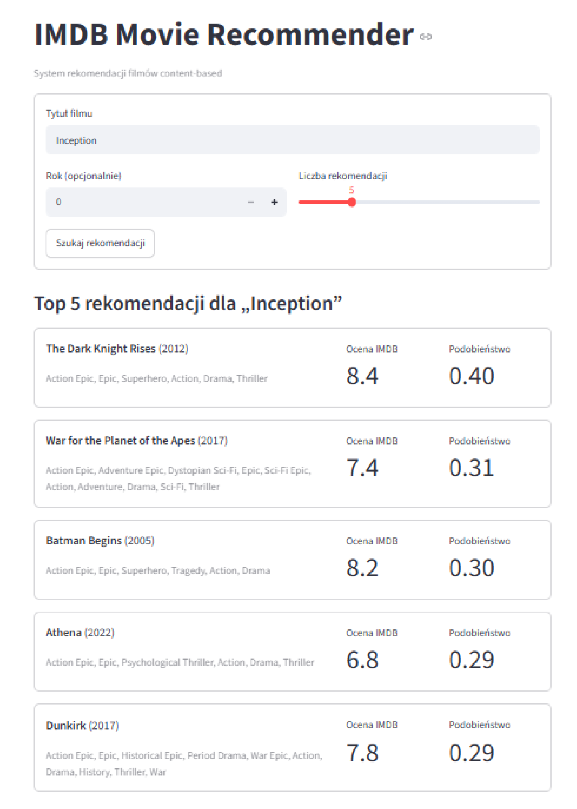
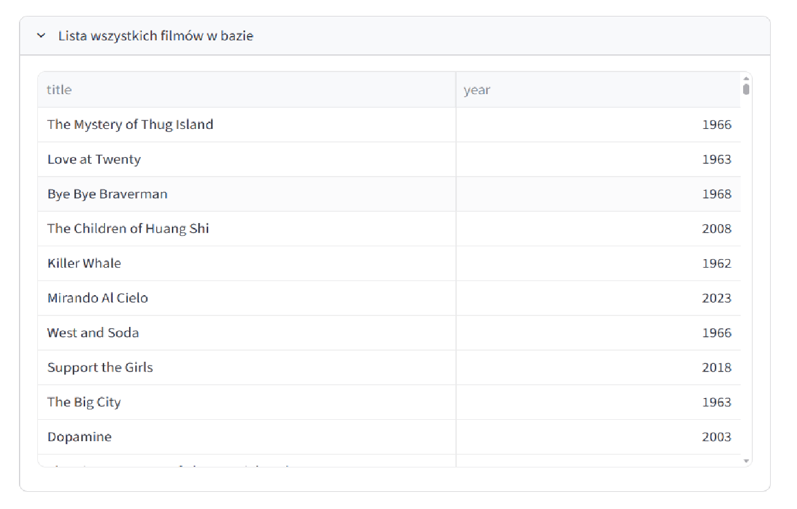

# IMDB Movie Recommender

System rekomendacji filmów oparty na podejściu content-based filtering.
Dla podanego tytułu zwraca listę podobnych filmów na podstawie gatunków,
reżysera, obsady i opisu bez potrzeby historii użytkownika.

## Technologie

- **FastAPI** - serwowanie API REST
- **scikit-learn** - TF-IDF + cosine similarity
- **pandas** - przetwarzanie danych
- **Docker** - konteneryzacja
- **Streamlit** - interfejs użytkownika

## Struktura projektu

```
.
├── app/          # Warstwa API (FastAPI)
├── data/         # Preprocessing i EDA
│   ├── raw/      # Dataset (final_dataset.parquet) – zawarty w repo
│   └── eda.ipynb # Analiza eksploracyjna danych
├── model/        # Model rekomendacji
│   ├── recommender.py  # Klasa ContentRecommender
│   └── train.py        # Skrypt trenowania
├── Dockerfile
├── docker-compose.yml
├── Makefile
└── requirements.txt
```

## Dane
Projekt wykorzystuje zbiór danych filmowych IMDB pochodzący z Kaggle.

Źródło danych: [Kaggle – IMDB Movies Dataset](https://www.kaggle.com/datasets/raedaddala/imdb-movies-from-1960-to-2023/data)

## Uruchomienie

Dataset (`final_dataset.parquet`, ~14 MB) jest już zawarty w repozytorium
w `data/raw/` - nie wymaga ręcznego pobierania.

### Opcja A – Docker (zalecana, zero konfiguracji)

```bash
docker-compose up --build
```

Model jest trenowany automatycznie podczas budowania obrazu.

Po uruchomieniu aplikacja dostępna jest pod adresami:
- FastAPI: http://localhost:8008
- Swagger UI: http://localhost:8008/docs
- Streamlit: http://localhost:8501


### Opcja B – lokalnie

```bash
# 1. Utwórz środowisko wirtualne i zainstaluj zależności
python -m venv .venv
source .venv/bin/activate      # Linux/macOS
# .venv\Scripts\activate       # Windows

pip install -r requirements.txt

# 2. Wytrenuj model
make train
# lub: python model/train.py

# 3. Uruchom API
make run
# lub: uvicorn app.main:app --reload --port 8008
```

- API dostępne pod: http://localhost:8008
- Swagger UI dostępny pod: http://localhost:8008/docs

Aby uruchomić interfejs użytkownika Streamlit, w drugim terminalu wpisz:
```bash
streamlit run app/streamlit_app.py
```

Streamlit dostępny jest pod:
http://localhost:8501

## Korzystanie z aplikacji Streamlit

Po uruchomieniu aplikacji otwórz `http://localhost:8501`.



1. Wpisz tytuł filmu, np. `Inception`.
2. Opcjonalnie podaj rok produkcji.
3. Wybierz liczbę rekomendacji.
4. Kliknij **Szukaj rekomendacji**.
5. Odczytaj listę podobnych filmów wraz z oceną IMDB i wynikiem podobieństwa.

Przykładowe tytuły: `Inception`, `Interstellar`, `The Matrix`, `Titanic`, `The Dark Knight`.

Dodatkowo w sekcji **Lista wszystkich filmów w bazie** można sprawdzić dostępne tytuły.



## Endpointy API

| Metoda | Endpoint     | Opis                              |
|--------|--------------|-----------------------------------|
| GET    | `/health`    | Status aplikacji                  |
| GET    | `/movies`    | Lista wszystkich filmów w bazie   |
| POST   | `/recommend` | Rekomendacje dla podanego tytułu  |
| GET    | `/docs`      | Interaktywna dokumentacja Swagger |

### Przykład zapytania

```bash
curl -X POST http://localhost:8008/recommend \
  -H "Content-Type: application/json" \
  -d '{"title": "Inception", "limit": 5}'
```

> Przy lokalnym uruchomieniu (`make run`) API słucha na porcie **8008**,
> w Dockerze na porcie **8008**.

### Przykład odpowiedzi

```json
{
  "count": 5,
  "results": [
    {
      "title": "Interstellar",
      "year": 2014,
      "genres": "Sci-Fi, Drama",
      "rating": 8.6,
      "score": 0.91
    }
  ]
}
```

Parametr `year` jest opcjonalny — jeśli podany, filtruje wyniki do ±15 lat.

## AutoML

AutoML nie zostało zastosowane — podejście content-based filtering oparte na TF-IDF
nie wymaga strojenia hiperparametrów przez AutoML. Wagi pól (genres, directors, stars,
description) dobrane zostały ręcznie na podstawie znaczenia semantycznego każdego pola.
Collaborative filtering nie zostało użyte ze względu na brak danych o historii użytkowników.

## Model ML

`ContentRecommender` łączy pola tekstowe każdego filmu w jeden ciąg z wagami:

| Pole        | Waga |
|-------------|------|
| genres      | ×4   |
| directors   | ×3   |
| stars       | ×2   |
| description | ×1   |

Następnie wektoryzuje je TF-IDF (bigramy, max 25 000 cech) i oblicza cosine similarity.
Wytrenowany model zapisywany jest do `model/artifacts/recommender.pkl`.

## Jakość kodu

```bash
make lint
# pylint app/ model/ data/preprocessing.py --fail-under=8
```

